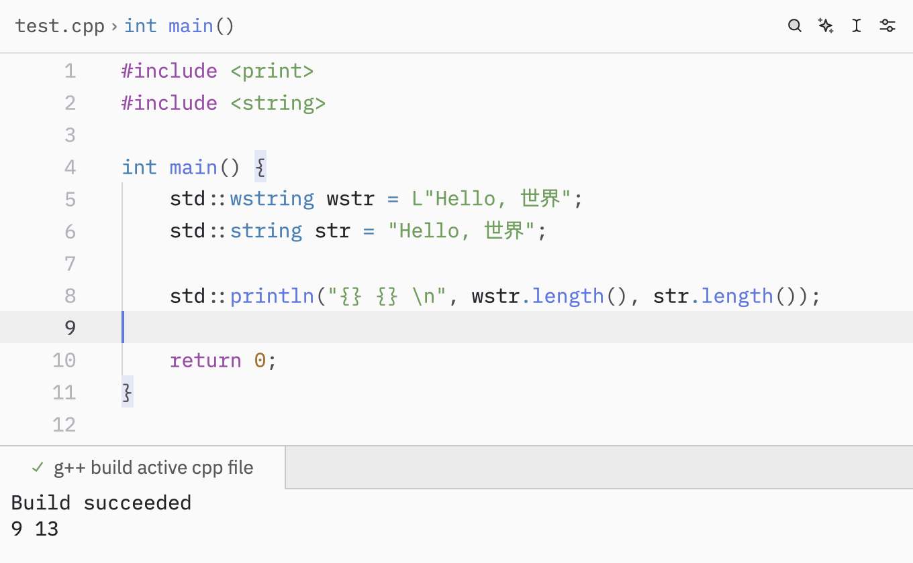

在 C/C++ 编程中，**字符串**是非常常用的数据类型，无论是处理文本、文件、还是用户输入，都离不开字符串。C 和 C++ 对字符串的处理方式有很大不同，本节将带你了解 C 风格字符串和 C++ 的 `std::string`，并介绍常见的字符串相关的基本知识。

## C++ 的 std::string

C++ 标准库提供了 `std::string` 类型，专门用于处理字符串。它可以自动管理内存，支持丰富的操作，避免了 C 风格字符串的各种“坑”。

想要使用 `std::string`，需要包含头文件 `<string>`：

```cpp
#include <string>

std::string str = "Hello, World!";
```

你可以像操作普通变量一样操作字符串：

```cpp
str = "new value";
```

`std::string` 提供了很多成员函数：

- `size()` 或 `length()`：获取长度
- `empty()`：判断是否为空
- `substr(pos, len)`：截取子串
- `find(str)`：查找子串
- `append(str)` 或 `+`：拼接字符串

在 C++ 中，推荐优先使用 `std::string`，因为它更安全、更方便。当然，如果正在使用 C 兼容的库，仍然需要使用 C 风格字符串。

## C 风格字符串

C 语言最早没有专门的字符串类型，只能用字符数组来表示字符串，并以特殊的结束符 `'\0'`（空字符）标记字符串的结尾。

例如：

```cpp
char str[10] = "hello";
```

实际等价于：

```cpp
char str[10] = {'h', 'e', 'l', 'l', 'o', '\0'};
```

C 标准库提供了一些常用的字符串操作函数，在 C++ 中头文件为 `<cstring>`：

- `strlen(str)`：计算字符串长度（不包括 `'\0'`）
- `strcpy(dest, src)`：复制字符串
- `strcat(dest, src)`：拼接字符串
- `strcmp(a, b)`：比较字符串

除了用 `char 数组`，C 风格字符串还可以用**字符指针** `char*` 来表示。比如：

```cpp
char* str = "hello";
```

这里 `str` 指向一个字符串常量 `"hello"`，它通常存放在**只读**内存区。**注意：该字符串内容不能修改。**

如果你需要**可修改的字符串**，可以用字符数组，或者用 `malloc` (C) 或者 `new` (C++) 动态分配空间：

```cpp
// 使用 malloc 在 C++ 中需要引入 <cstdlib>
#include <cstdlib>
#include <cstring>

char* str = (char*)malloc(20 * sizeof(char)); // 分配 20 字节
strcpy(str, "hello");
```

**用完后需要手动释放：**

```cpp
free(str);
```

C++ 的 `std::string` 会自动扩容，但 C 风格字符串不会。如果你想在 C 中使用自动扩容的字符串，只能使用手动 `malloc` 的 `char*` 实现自动扩容，通常需要手动分配更大的空间，并用 `realloc` 扩展：

```cpp
#include <cstdlib>
#include <cstring>

char* str = (char*)malloc(10); // 初始分配 10 字节
strcpy(str, "hello");

str = (char*)realloc(str, 50); // 扩容到 50 字节，这里其实可以计算更精确的大小来分配，防止浪费
strcat(str, " world!"); // 拼接字符串
```

但是，这种方法比较麻烦，而且容易出错，所以在 C++ 中更推荐使用 `std::string`。

<Callout type="warn">
    **再次提醒**

    - **`char *` 用完后需要手动释放！**
    - **一定要分配足够的空间！**
</Callout>

## C 风格字符串与 std::string 的互转

C 风格字符串和 `std::string` 之间可以相互转换：

```cpp
// C 风格字符串转 std::string
const char* cstr = "hello";
std::string str1 = cstr;

// std::string 转 C 风格字符串
std::string str2 = "world";
const char* cstr2 = str2.c_str();
```

## 字符串的输入输出

在 C++ 中，可以使用 `std::cin` 和 `std::cout` 来进行字符串的输入输出。

但是，`scanf` 和 `printf` 只能处理 C 风格字符串。如果 `printf` 要传入 `std::string`，需要使用 `c_str()` 方法将其转换为 C 风格字符串：

```cpp
#include <string>
#include <cstdio>

int main() {
    std::string str = "Hello, World!";
    printf("%s\n", str.c_str()); // 使用 c_str() 转换
    return 0;
}
```

其他的输入输出在[输入输出](/docs/cpp/basic/io)一节中提到，这里不过多赘述。

## '\0' 的作用与风险

在 C 风格字符串中，`'\0'` 是**字符串结束符**。所有字符串操作函数（如 `strlen`、`strcpy` 等）都依赖于 `'\0'` 来判断字符串的结尾。(在遇到 `\0` 之后，函数就会停止)

<Callout>`\0` 实际上是 ASCII 码中的空字符，数值为 0。</Callout>

因此，使用 C 风格字符串时，必须确保字符串以 `'\0'` 结尾，否则会导致**未定义行为**，如访问越界、程序崩溃等。

```cpp
char str[5] = {'h', 'e', 'l', 'l', 'o'}; // 没有 '\0' 结尾
printf("%s\n", str); // 未定义行为，可能会打印垃圾数据或崩溃，因为他会处理到从 h 开始一直找到内存中的第一个 '\0' 结束。
```

又或者

```cpp
char str[] = {'H', 'e', 'l', 'l', 'o', '\0', ' ', 'W', 'o', 'r', 'l', 'd', '\0'};
printf("%s\n", str);
```

上例中，printf 会从 `str` 开始打印，直到遇到第一个 `'\0'`，所以只会输出 `Hello`。

使用 C++ 的 `std::string` 时，无需在结尾手动加 `'\0'`，因为它会自动管理字符串的结尾。（但是，请不要在字符串中间使用 `\0`，哪怕是 `std::string` 也会进行截断！）

## 宽字符和宽字符串

传统的 `char` 类型只占用 1 字节（8 位），最多能表示 256 个不同的字符（ASCII 码）。但对于中文、日文、韩文等字符，或者一些特殊符号，1 字节远远不够。string 也会使用多个字符来表示这些符号，但是你无法准确的获取字符串的长度，同时，假如你进行了分割字符串的操纵，可能会造成不符合预期的结果。因此，C/C++ 提供了**宽字符类型** `wchar_t`，通常占用 2 字节（在 Windows 下）或 4 字节（在 Linux 下），可以表示更多字符（如 Unicode）。

宽字符和宽字符串使用 `L` 前缀表示：

```cpp
wchar_t wstr = L'你';
std::wstring wstr2 = L"Hello, 世界!";
```

宽字符的操作函数在 `<cwchar>` 头文件中：

wcout 和 wcin 用于宽字符串的输入输出：

```cpp
#include <iostream>

int main() {
    std::wstring wstr = L"Hello, 世界!";
    std::wcout << wstr << std::endl; // 输出宽字符串
    return 0;
}
```

通过下图我们可以看出，wstring 获取了正确的字符串长度，而 string 则没有。


