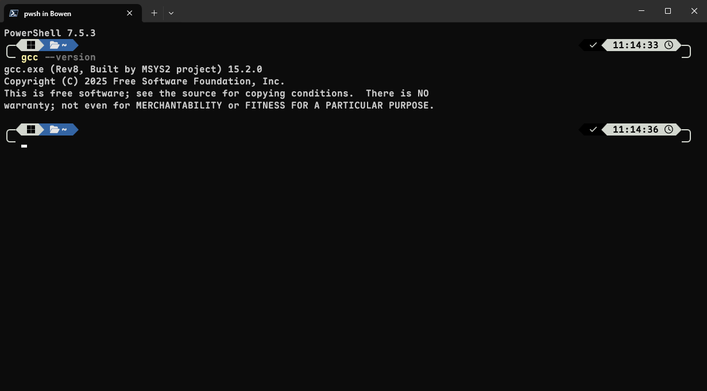

import { Tab, Tabs } from "fumadocs-ui/components/tabs";
import { Card, Cards } from "fumadocs-ui/components/card";
import { ClosedCaption } from "lucide-react";
import { Steps, Step } from "fumadocs-ui/components/steps";

编译器是一种基础工具，它能把人类编写的源代码翻译成计算机可以直接执行的程序。没有编译器，计算机无法理解和运行你的代码。学习编程时，首先需要安装并配置好编译器，这样才能把你的代码变成可以运行的应用。

与大多数现代语言不同，C/C++ 是由国际标准委员会制定的**标准规范**，而并没有官方统一的编译器实现。因此，我们有许多不同的 C/C++ 编译器可供选择，比如 GCC、LLVM + Clang 和 MSVC 等，每种编译器在不同操作系统上有各自的安装方式和特性。

接下来，我们将介绍在主流操作系统（Windows、macOS、Linux）下的 C/C++ 编译器安装步骤及常见开发工具的配置方法。

<Tabs items={["Windows", "MacOS", "Linux"]}>
    <Tab>
        ## Windows

        在 Windows 上，我们可以使用 Microsoft Visual Studio 或者 MSYS 2 来安装工具链（也可以使用 Windows Subsystem for Linux 2 安装 Linux 的 C/C++ 工具链，方法和 Linux 相同）。主要区别如下：

        <Cards>
            <Card title={"MSYS 2"}>
                <ul className="list-disc list-inside space-y-1">
                    <li>提供了软件包管理器，可以非常方便的在 Windows 下配置 CMake、Make、GCC、Clang 等开发工具</li>
                    <li>相比于 Visual Studio，MSYS 2 的工具链更加轻量，占用的磁盘空间更少</li>
                    <li>使用 GCC/Clang 可以保证多平台项目开发构建工具的一致性</li>
                    <li>提供一个类 Unix 环境，提供了一个 POSIX 兼容的 Shell (在后续章节会深入探索)</li>
                    <li>没有图形化界面的配置方法，对于新手而言可能有些挑战</li>
                </ul>
            </Card>
            <Card title={"Visual Studio"}>
                <ul className="list-disc list-inside space-y-1">
                    <li>微软官方的集成开发环境 (IDE)，功能强大，支持代码编辑、调试、版本控制等多种功能</li>
                    <li>内置 MSVC 编译器，性能优异，适合 Windows 平台的应用开发</li>
                    <li>在 Windows 下与系统的集成更好，提供了许多额外的工具库</li>
                    <li>体积较大，功能较多较繁杂</li>
                    <li>仅支持 Windows，且有部分功能与 GCC/Clang 不兼容，对跨平台项目来说不友好</li>
                </ul>
            </Card>
        </Cards>

        具体的选择应该看你的需求和偏好。对于电子与计算机院的学生，或是以后想要从事计算机方面工作的同学，我建议你至少需要学会对 ~~Linux~~ MSYS 2 的安装与配置。

        <Callout>
            事实上，私以为 Windows 是所有系统中开发体验最差，开发效率最低，环境配置最繁琐的系统。
        </Callout>

        ### MSYS 2

        <p className="flex gap-2 text-sm text-gray-500"><ClosedCaption className="size-5" /> 该节由 **Goldbro233** 编写</p>

        #### 什么是 MSYS2

        <Callout>我们引用一部分官网对于 MSYS2 的描述：MSYS2 是一套工具和库的集合，为您提供一个易于使用的环境，用于构建、安装和运行原生 Windows 软件。</Callout>

        在笔者看来，阅读这篇指南的同学们你们很成功的选择一个离 C/C++语言**最远**的操作系统，所以 C/C++也很成功的**抛弃**了你们。

        当然上面这句话不是我说的，是我在找其他教程的时候看到的，当然你们也不用担心，我们马上就会解决上面这个问题。

        MSYS2 就是这样一套工具链，通过很简单的一些操作，就能让你在 Windows 平台上也能获得类 Unix 的开发体验。

        在以下这边指~~北~~南当中，我会简单介绍如何安装 MSYS2，如何简单的使用 vim，如何修改 MSYS2 的镜像源来加快下载速度，如何找到自己合适的安装包，以及最后如何安装 C/C++ 工具链。

        我们马上开始 :D

        #### 具体指南
        <Steps>
            <Step>
                ##### 下载 MSYS2

                请你直接点击以下的对应架构进行下载👇(请各位自行解决如何访问 Github 的问题)：

                1. [X86-64](https://github.com/msys2/msys2-installer/releases/download/nightly-x86_64/msys2-x86_64-latest.exe)
                2. [Arm64](https://github.com/msys2/msys2-installer/releases/download/nightly-x86_64/msys2-arm64-latest.exe)
            </Step>
            <Step>
                ##### **基本安装 MSYS2**

                

                在进行祖传的猛猛点击下一步以后，我们就会进入这样一个终端界面：

                （如果没有终端打开的话，我们去找到新安装的程序，点击 `MSYS2 UCRT64` 即可。）

                

                <Callout>
                    不必害怕终端界面，这是一个比图形化界面**更加好操作**的界面，接下来我们就会简单介绍。

                    如果你想要深入学习计算机，那么终端界面是你的必学项目。
                </Callout>

                

                MSYS2 使用的是 `bash` 作为终端，不过对我们来说没有什么区别。我们会首先介绍包管理器 `pacman` 的使用，这是我们在终端当中的“应用商店”，我们使用这个软件来安装各种程序。

                我们在终端中输入这个命令来安装 `vim` 作为我们的编辑器：

                （如果安装速度较慢请不用担心，这是因为我们还没有更换软件源）

                ```bash
                pacman -S vim
                ```

                

                输入 `Y` 即可继续安装，这是需要进行确认的一个步骤。

                <Callout> 恭喜你，成功用 pacman 安装了第一个软件！接下来我们都会用这样的步骤来安装软件。</Callout>
            </Step>
            <Step>
                ##### **更换软件源**

                MSYS2 的软件源的服务器在国外，我们可以更换国内的软件源来加快下载速度。

                使用这样的命令更换软件源：

                ```bash
                sed -i "s#https\?://mirror.msys2.org/#https://mirrors.tuna.tsinghua.edu.cn/msys2/#g" /etc/pacman.d/mirrorlist*
                ```

                这样我们就将镜像源替换到了国内的清华镜像源。
            </Step>
            <Step>
                ##### **寻找并下载对应软件包**

                MSYS2 上面有大量的软件包可供下载，我们可以使用[官方网站](https://packages.msys2.org/queue)来寻找你需要的对应软件包。

                对于 pacman 来说，我们先来对于 MSYS2 和软件源进行一次完全的更新：

                ```bash
                pacman -Syyu
                ```

                输出大概是这个样子，不要忘记时常过来进行一下更新 :)

                （此处可能要求你重新启动 MSYS2，不必担心同意然后重启即可。）

                

                接下来我们来下载对应的 C/C++ 工具链，这里已经帮你们找好了对应的软件包，只需要复制下面的命令即可：

                ```bash
                pacman -S mingw-w64-ucrt-x86_64-make mingw-w64-ucrt-x86_64-gcc mingw-w64-ucrt-x86_64-gdb mingw-w64-ucrt-x86_64-cmake mingw-w64-ucrt-x86_64-clang-tools-extra -y
                ```

                这样软件包已经安装完成了，但是我们还没有办法在 Windows 的命令行环境下调用这个软件，遂下一步就是添加 Windows 的环境变量。
            </Step>
            <Step>
                ##### **添加 Windows 环境变量**

                还记得你的 MSYS2 装在哪里了吗？ 默认状态下 应该是在 `C:\msys2` 这个目录下。

                我们将 `C:\msys64\usr\bin` 和 `C:\msys64\ucrt64\bin` 添加至系统的环境变量下。

                （如何添加环境变量请自行搜索，毕竟不能什么都喂到嘴里来 (~~其实是笔者懒了~~) ）

                之后我们打开一个 Windows 中的终端，输入 `gcc --version`，如果出现了大抵是以下的输出，证明你的工具链已经安装完成了，可以踏入 C/C++ 的世界了！恭喜！

                
            </Step>
        </Steps>

        #### 补充阅读部分

        ##### UCRT 是什么呢？

        这里我们先把[官方介绍](https://www.msys2.org/docs/environments/)丢上来，有兴趣可以直接自行阅读。

        简单来说是一个通用的 C 语言运行时，在构建时和运行时都具有更好的与 MSVC 的兼容性。

        ##### pacman 是什么呢？

        这里我们也把[官方介绍](https://wiki.archlinux.org/title/Pacman)丢上来，只不过这是 Archlinux Wiki。

        做个简单介绍就是：这原本是 Archlinux 的包管理器，MSYS2 拿过来做了一部分改动，不过大体上是基本相同的。所以想要学习更多的使用方法直接看 Wiki也可以。

        ##### 如何找到对应版本的软件包？

        我们还是把[官方介绍](https://www.msys2.org/docs/package-naming/)丢上来，请各位自行阅读~

        ##### 不太想看文档怎么办？

        主包主包，文档实在太多了，我实在不想看怎么办？

        **没办法，你一定得读喵！**

        不过群里的大家都还是很友好的，欢迎提问~

        （在提问前请先阅读一下[提问的智慧](https://github.com/ryanhanwu/How-To-Ask-Questions-The-Smart-Way/blob/master/README-zh_CN.md)和[别像弱智一样提问](https://github.com/tangx/Stop-Ask-Questions-The-Stupid-Ways/blob/master/README.md)）

        ### Visual Studio

        Visual Studio 的安装请参考 [快速入门](/docs/cpp/start#vs)

        ### Clion （内置 MinGW）

        Clion 内置 MinGW 编译工具，对于新手快速入门来说比较方便，但是长期学习使用 C/C++ 不建议使用。

        安装请参考 [快速入门](/docs/cpp/start#clion)
    </Tab>
    <Tab>
        ## MacOS

        MacOS 安装 C/C++ 环境也相对简单，主要分为官方的 Xcode 安装和 Homebrew 安装。

        ### XCode

        XCode 是苹果官方的集成开发环境，提供了 GCC、Clang、Make 等工具。

        #### 安装 XCode 命令行工具

        1. 打开终端（可以使用 `Command + Space`，输入 Terminal 后回车）

        2. 输入以下命令

        ```bash
        xcode-select --install
        ```

        3. 按照提示进行操作。

        #### 安装完整的 XCode 环境

        完整的 XCode 环境还带有 XCode 的集成开发环境，如果你想要开发 iOS、iPadOS、MacOS、WatchOS、TVOS、VisionOS 的应用，可以下载完整版的 XCode。

        完整版的 XCode 安装更加简单，打开 App Store，搜索 XCode 安装即可。安装完后，首次打开 XCode 会自动安装所需工具链。

        ### Homebrew

        如果你不想使用官方的 XCode 来安装环境，也可以使用 MacOS 下的第三方包管理器，如 Homebrew，Port 来安装。这里以 Homebrew 为例。

        1. **安装 Homebrew**

        ```bash
        /bin/bash -c "$(curl -fsSL https://raw.githubusercontent.com/Homebrew/install/HEAD/install.sh)"
        ```

        按照提示输入密码，等待安装。

        2. 安装 GCC/Clang

        GCC:

        ```bash
        brew install gcc
        ```

        Clang:

        ```bash
        brew install llvm
        ```

        <Callout type="warn">
            **注意**

            Homebrew 安装的 clang 命令会带有版本号后缀（例如 clang-15），以避免与系统自带的 clang 冲突。你可以通过 brew info llvm 查看具体的可执行文件路径。
        </Callout>
    </Tab>
    <Tab>
        ## Linux

        在 Linux 下安装 C/C++ 环境较为简单，大多数发行版的包管理器中就含有 GCC/Clang 工具链。下面以 Ubuntu 和 Arch Linux 为例，介绍如何安装 GCC/Clang 工具链。

        <Callout>
            **提示**

            GCC/Clang 编译器可以共存，而并非只能选择其中一个。
        </Callout>

        <Tabs items={["Arch Linux", "Ubuntu"]}>
            <Tab>
                ### Arch Linux

                Arch Linux 使用 Pacman 作为包管理器。使用 Pacman 即可安装工具链。

                #### GCC

                ```bash
                sudo pacman -S base-devel cmake
                ```

                base-devel 包含了 GCC、Make 等基本开发工具。事实上我们一般会选择在安装 Arch Linux 的过程中直接安装 base-devel 包。

                验证是否安装完毕

                ```bash
                gcc --version
                make --version
                cmake --version
                ```

                #### LLVM + Clang

                ```bash
                sudo pacman -S clang llvm lld lldb make cmake
                ```

                验证是否安装完毕

                ```bash
                clang --version
                make --version
                cmake --version
                ```

                有关 GCC 和 Clang 的区别，感兴趣的同学可以自行查阅。
            </Tab>
            <Tab>
                ### Ubuntu

                Ubuntu 使用 Apt 作为包管理器。

                #### GCC

                ```bash
                sudo apt install build-essential cmake
                ```

                build-essential 类似于 Arch Linux 的 base-devel，包含了 GCC、Make 等基本开发工具。

                验证是否安装完毕

                ```bash
                gcc --version
                make --version
                cmake --version
                ```

                #### LLVM + Clang

                ```bash
                sudo apt install clang llvm lld lldb make cmake
                ```

                验证是否安装完毕

                ```bash
                clang --version
                make --version
                cmake --version
                ```

                有关 GCC 和 Clang 的区别，感兴趣的同学可以自行查阅。
            </Tab>
        </Tabs>
    </Tab>
</Tabs>
