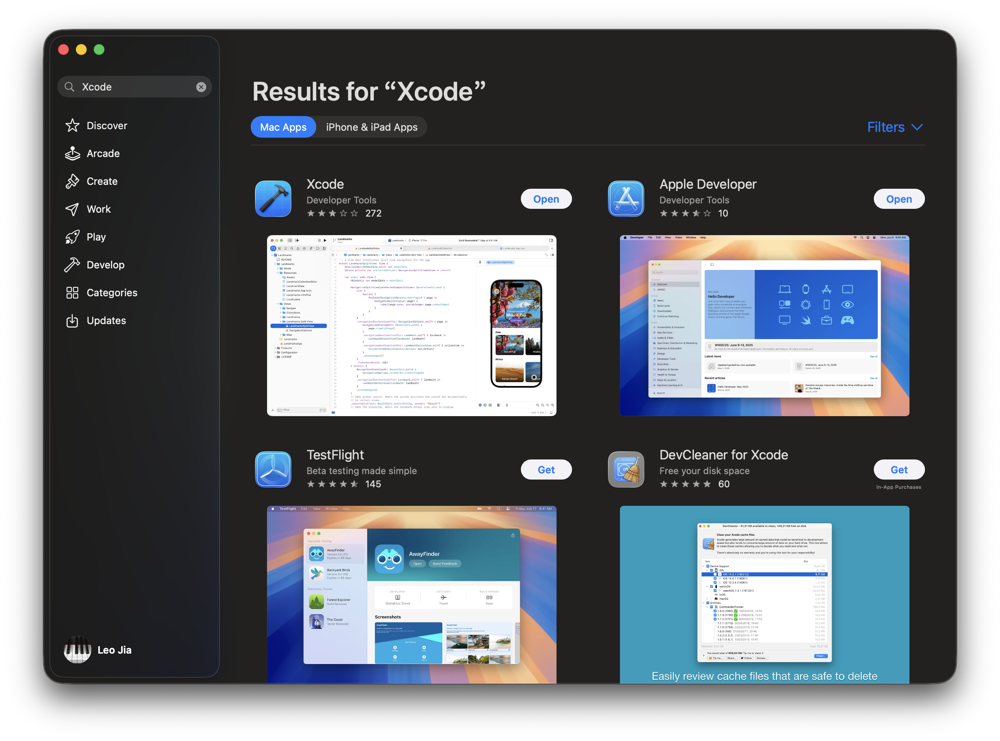
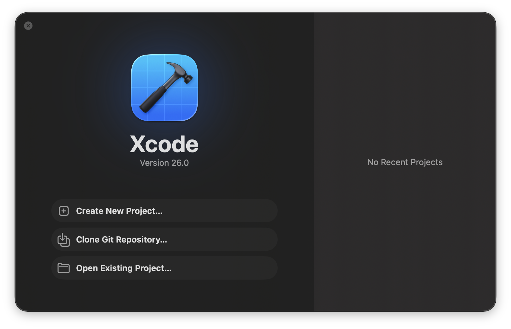
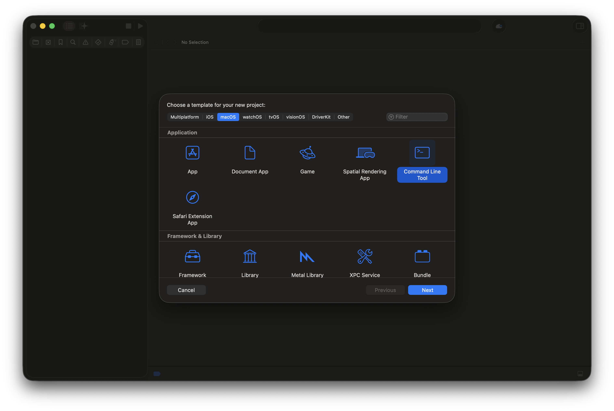
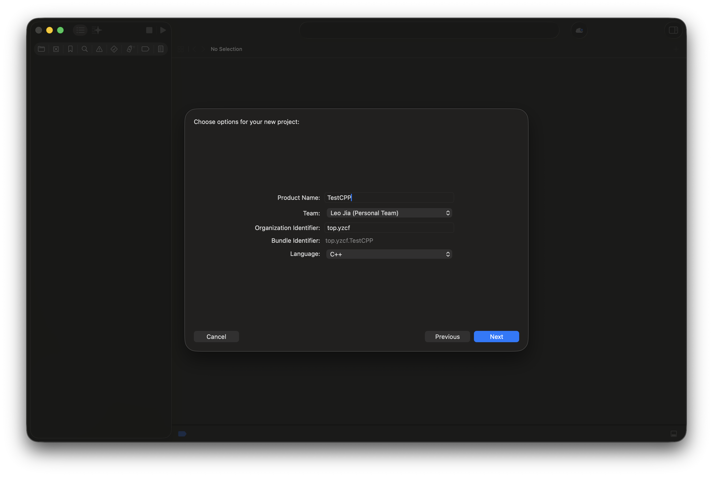
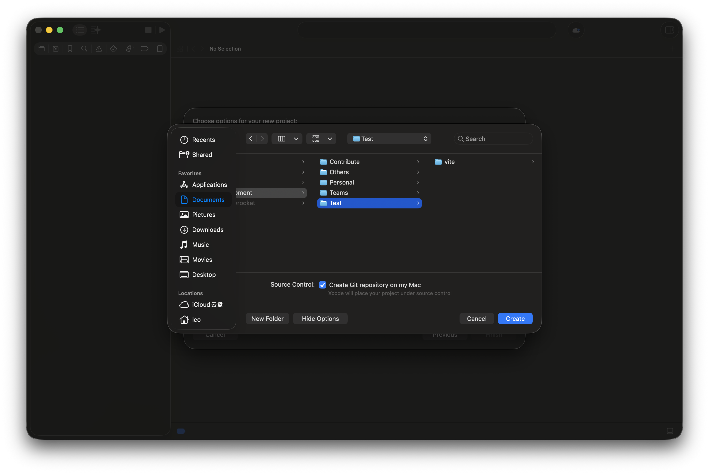
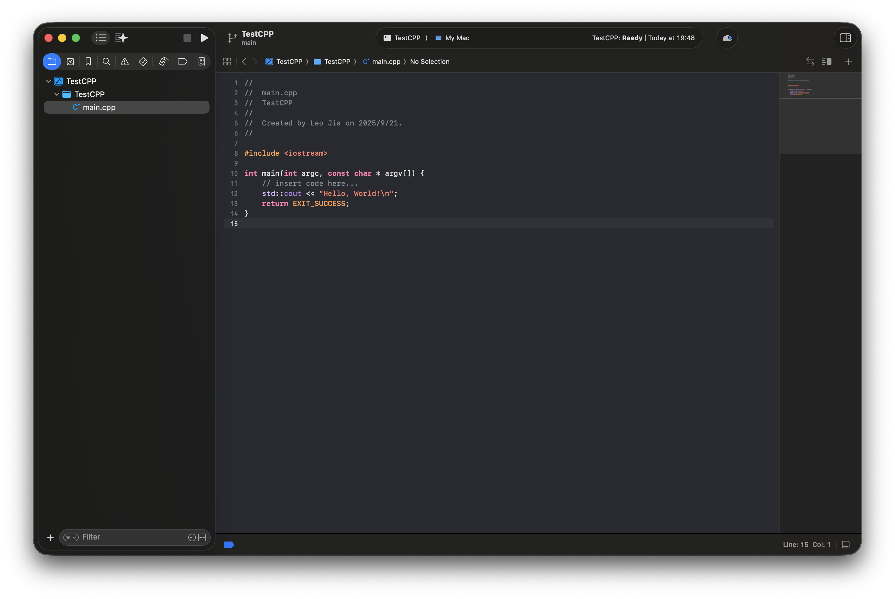

import { Tab, Tabs } from "fumadocs-ui/components/tabs";

安装完编译器后，你还需要一个趁手的代码编辑工具。想象一下，编译器就像是翻译官，而 IDE 或编辑器就是你的写作台——一个好的写作环境能让你的编程之旅事半功倍！

常见的 C/C++ IDE/编辑器 有 Visual Studio，Clion，Xcode，Visual Studio Code，Zed 等等。

<Callout>
    你也许还听说过 Dev-C++ 的大名。它是一个非常简单、且无需配置开箱即用的编辑器。由于他轻量、不提供代码补全等特性，被各大竞赛使用。然而，在日常开发中，我们不推荐使用 Dev-C++，理由如下：

    - Dev-C++ 带的 MinGW 环境过老
    - 已经不再更新（尽管之前更新了 Dev-C++ 6 短暂的活了一段时间）
    - 过于简陋
    - 没有代码补全，编码效率低
</Callout>

<Callout>
    **Tips：IDE 和 编辑器的区别**

    <Cards>
        <Card title={"IDE"}>
            IDE（集成开发环境）通常集成了代码编辑、编译、调试、项目管理等多种功能，适合进行复杂或大型项目的开发。例如 Visual Studio、CLion、Xcode 都属于 IDE。
        </Card>
        <Card title={"编辑器"}>
            编辑器更加轻量，主要用于编写和编辑代码，通常需要通过插件或外部工具来实现编译和调试等功能。比如 Visual Studio Code、Zed 就是常见的代码编辑器。
        </Card>
    </Cards>

    对于初学者而言，IDE 是一个不错的选择。他开箱即用，可以快速上手，而无需配置复杂的环境。而对于 C/C++ 这类编译型语言来说，编辑器则需要更多的配置和学习成本。
</Callout>

下面我们简单介绍几个主流 IDE/编辑器 的安装

<Tabs items={["Visual Studio", "Clion", "Xcode", "VSCode", "Zed"]}>
    <Tab>
        ## Visual Studio 2022 (`Windows`)

        该内容详见 [快速入门](/docs/cpp/start#vs)

        ## Visual Studio 2010 (`Windows`)

        <Callout type="error">
            **注意**

            Visual Studio 2010 已经停止支持，使用旧版本可能会遇到兼容性问题和安全风险。强烈建议使用 Visual Studio 2022 或更高版本。

            由于官方已经不再提供 Visual Studio 2010 的安装包，这里提供的安装包是由互联网第三方网站提供，可能会存在安全问题，请自行斟酌是否下载。
        </Callout>

        下载链接：

        ```
        ed2k://|file|cn_visual_studio_2010_express_x86_dvd_532024.iso|1884567552|3BB6EFEECD4966BE6DFAAB5D579A80CF|/
        ```

        按照安装包的指示安装即可。
    </Tab>
    <Tab>
        ## Clion (`Windows`/`MacOS`/`Linux`)

        Clion 是 JetBrains 开发的 C/C++ IDE，支持 Windows、MacOS、Linux 等系统。

        Clion 的配置和安装已经在 [快速入门](/docs/cpp/start#clion) 中讲过，其中 MacOS 和 Linux 的配置教程与 Windows 类似，这里不过多赘述。
    </Tab>
    <Tab>
        ## Xcode (`MacOS`)

        Xcode 是 Apple 开发的 IDE，支持 Object C、Swift 以及 C/C++ 的编写，仅支持 MacOS 系统。如果你想开发 iOS、iPadOS、MacOS、WatchOS、TvOS、VisionOS 应用，那么 Xcode 是你不错的选择。

        安装 Xcode 比较简单。在 App Store 中搜索 Xcode，点击下载并安装即可。

        

        打开 Xcode

        

        点击 `Create New Project`，选择 `MacOS` > `Command Line Tool`，点击 `Next`

        

        输入 Project Name，选择 `Next`

        

        设置项目的保存位置，点击 `Create`

        

        开始编码🧑‍💻

        
    </Tab>
    <Tab>
        ## Visual Studio Code (`Windows`/`MacOS`/`Linux`/`Web`)

        `WIP`
    </Tab>
    <Tab>
        ## Zed (`MacOS`/`Linux`/`Windows 未完全支持`)

        `WIP`
    </Tab>
</Tabs>
