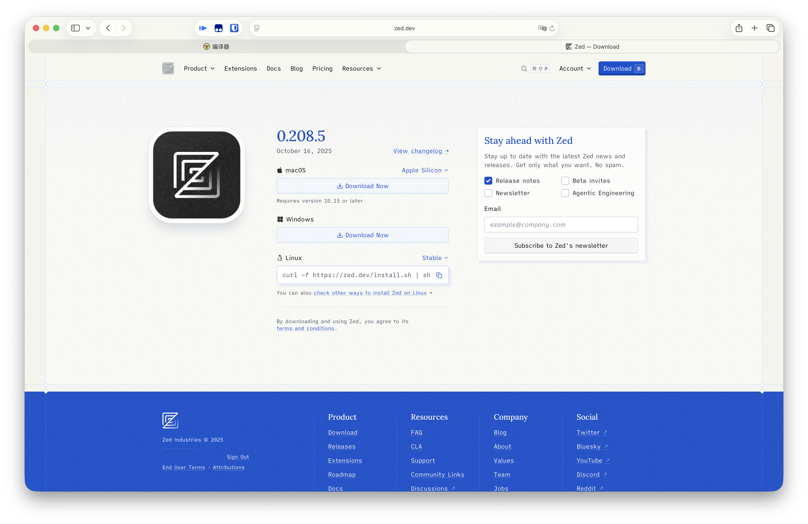
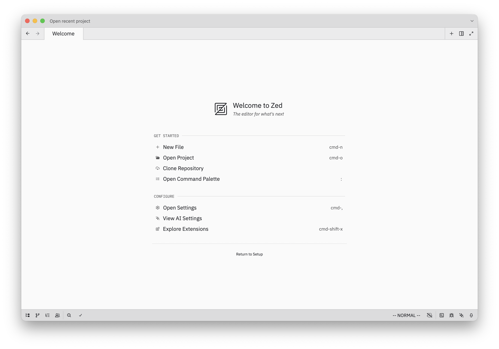
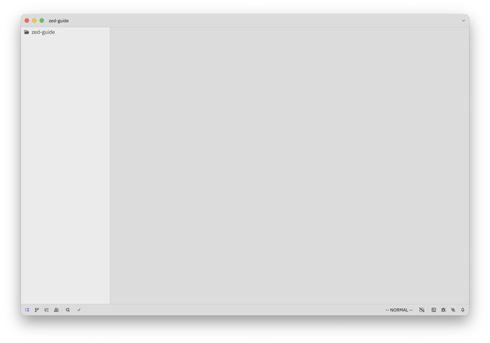
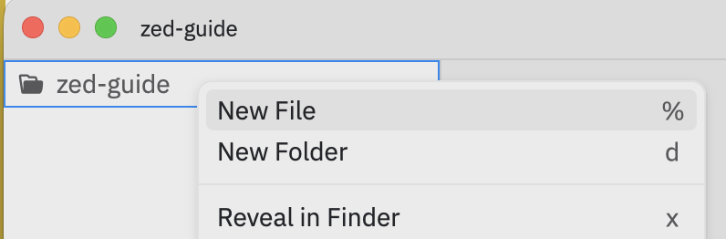
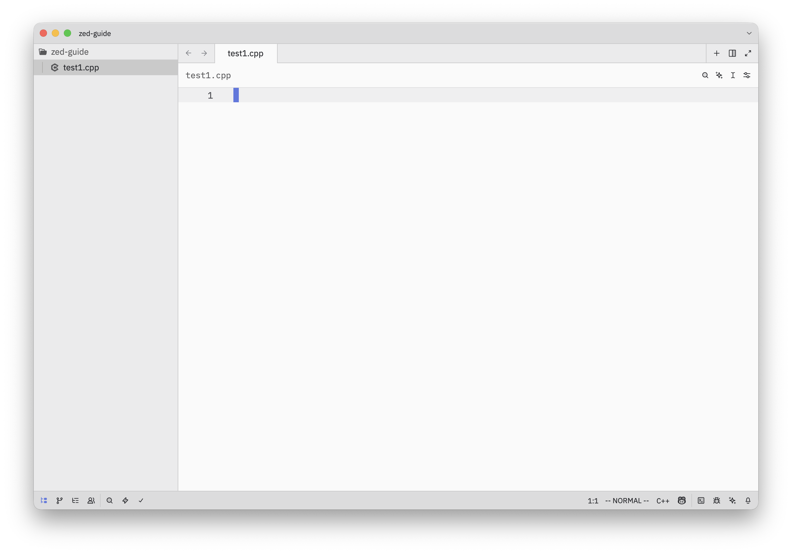
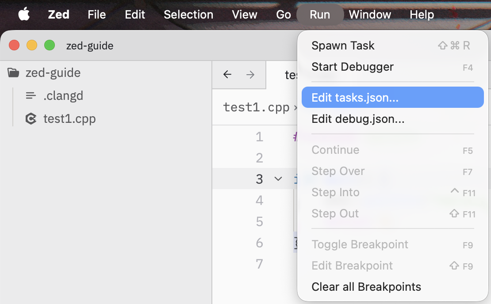
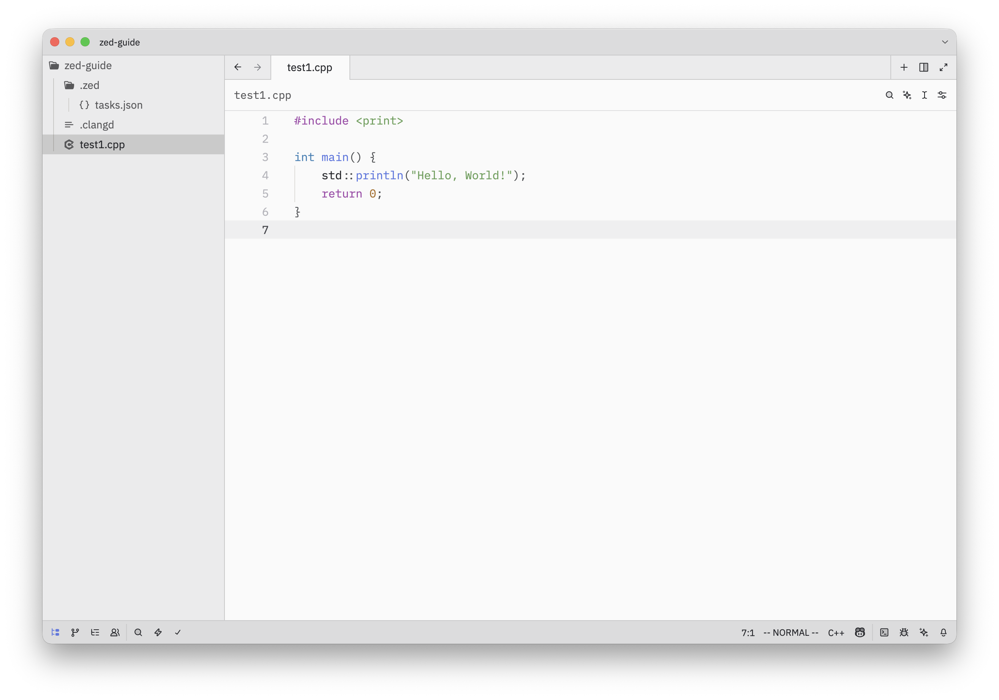
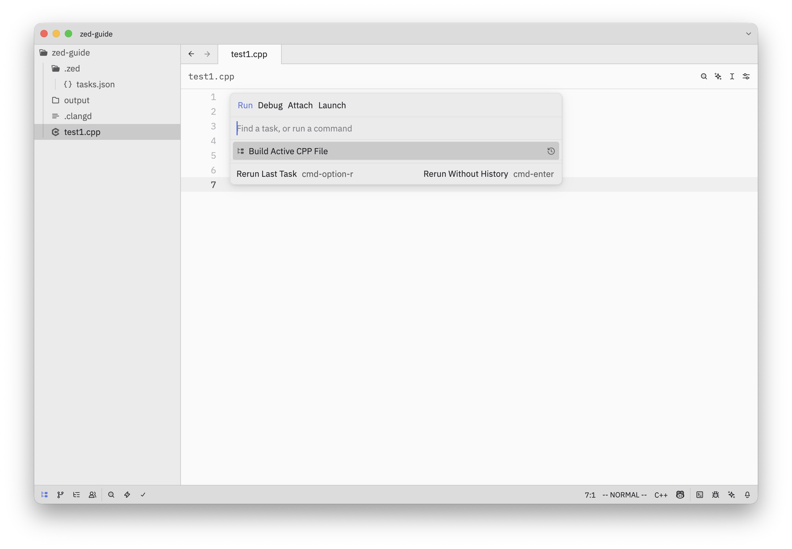
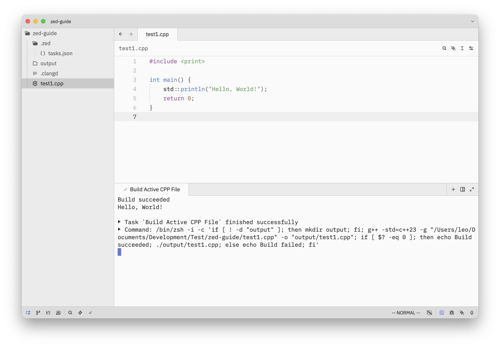

import { Tab, Tabs } from "fumadocs-ui/components/tabs";

安装完编译器后，你还需要一个趁手的代码编辑工具。想象一下，编译器就像是翻译官，而 IDE 或编辑器就是你的写作台——一个好的写作环境能让你的编程之旅事半功倍！

常见的 C/C++ IDE/编辑器 有 Visual Studio，Clion，Xcode，Visual Studio Code，Zed 等等。

<Callout>
    你也许还听说过 Dev-C++ 的大名。它是一个非常简单、且无需配置开箱即用的编辑器。由于他轻量、不提供代码补全等特性，被各大竞赛使用。然而，在日常开发中，我们不推荐使用 Dev-C++，理由如下：

    - Dev-C++ 带的 MinGW 环境过老
    - 已经不再更新（尽管之前更新了 Dev-C++ 6 短暂的活了一段时间）
    - 过于简陋
    - 没有代码补全，编码效率低
</Callout>

<Callout>
    **Tips：IDE 和 编辑器的区别**

    <Cards>
        <Card title={"IDE"}>
            IDE（集成开发环境）通常集成了代码编辑、编译、调试、项目管理等多种功能，适合进行复杂或大型项目的开发。例如 Visual Studio、CLion、Xcode 都属于 IDE。
        </Card>
        <Card title={"编辑器"}>
            编辑器更加轻量，主要用于编写和编辑代码，通常需要通过插件或外部工具来实现编译和调试等功能。比如 Visual Studio Code、Zed 就是常见的代码编辑器。
        </Card>
    </Cards>

    对于初学者而言，IDE 是一个不错的选择。他开箱即用，可以快速上手，而无需配置复杂的环境。而对于 C/C++ 这类编译型语言来说，编辑器则需要更多的配置和学习成本。
</Callout>

下面我们简单介绍几个主流 IDE/编辑器 的安装

<Tabs items={["Zed", "Visual Studio", "Clion", "Xcode", "VSCode"]}>
    <Tab>
        ## Zed (`MacOS`/`Linux`/`Windows`)

        Zed 是一款新兴的跨平台、低占用、简洁、高效的开源代码编辑器，由前 Atom 团队呈现，支持实时协作和云端存储，适合团队开发和远程工作。

        <Callout type="warn">Zed 目前还没有进入正式版，所以可能部分功能支持不完善或有 Bug。如果遇到问题，或有需要的功能，可以去 zed 的官方 [Github 仓库](https://github.com/zed-industries/zed) 提交 [Issues](https://github.com/zed-industries/zed/issues)</Callout>

        <Callout>本节教的是单文件编译的配置，适合 OI 竞赛或新手学习使用。项目的配置在后面工程化章节中可能会提到。</Callout>

        1. 登陆官方网站 https://zed.dev ，点击 `Download now` 按钮，选择对应的系统版本进行下载。（Linux 用户可以使用系统自带的包管理器进行安装）

           

        2. 下载并安装完成后，打开 Zed。

           

        3. 点击 `Open Repository` 按钮，选择一个空白的文件夹作为工作区（或者是打开已有的文件目录）。

           

           在左侧的文件树中，右键点击空白处，选择 `New File` 创建一个新的文件，命名为 `test.cpp`。

           
           

        4. 在根目录再次新建文件 `.clangd`，配置 clangd（C++ 的语言服务器，用于 IDE 自动补全使用）

           例如，我想使用 C++ 23 的标准，可以在 `.clangd` 中写入以下内容：

           ```
           CompileFlags:
             Add:
               - -std=c++23
           ```

           具体配置可以参考 [Clangd 官方文档](https://clangd.llvm.org/config.html)。

        5. 点击顶部菜单上的 `Run` > `Edit tasks.json` （Windows 和 Linux 可能会隐藏在左上角 `三` 里）

           

        6. 在打开的 `tasks.json` 文件中，添加以下内容：

           ```json title="tasks.json"
           [
             {
               "label": "Build Active CPP File",
               "command": "if [ ! -d \"output\" ]; then mkdir output; fi; g++ -std=c++23 -g \"$ZED_FILE\" -o \"output/$ZED_FILENAME\"; if [ $? -eq 0 ]; then echo Build succeeded; ./output/$ZED_FILENAME; else echo Build failed; fi",
               "use_new_terminal": false,
               "allow_concurrent_runs": false,
               "reveal": "always",
               "reveal_target": "dock",
               "hide": "never",
               "shell": "system",
               "show_summary": true,
               "show_command": true
             }
           ]
           ```

           <Callout>其中 `--std=c++23` 为 C++ 标准，你可以把他修改为你想要的标准，比如 `c++17`, `c++26` 等等。</Callout>

        7. 保存 `tasks.json` 文件，回到 `test.cpp`，编写你的 C++ 代码。

           

        8. 点击顶部菜单的 `Run` > `Spawn Task` > `Build Active CPP File` (或者使用快捷键启动 `Spawn Task`)，Zed 会自动编译并运行你的代码。

           
           
    </Tab>
    <Tab>
        ## Visual Studio 2022 (`Windows`)

        该内容详见 [快速入门](/docs/cpp/start#vs)

        ## Visual Studio 2010 (`Windows`)

        <Callout type="error">
            **注意**

            Visual Studio 2010 已经停止支持，使用旧版本可能会遇到兼容性问题和安全风险。强烈建议使用 Visual Studio 2022 或更高版本。

            由于官方已经不再提供 Visual Studio 2010 的安装包，这里提供的安装包是由互联网第三方网站提供，可能会存在安全问题，请自行斟酌是否下载。
        </Callout>

        下载链接：

        ```
        ed2k://|file|cn_visual_studio_2010_express_x86_dvd_532024.iso|1884567552|3BB6EFEECD4966BE6DFAAB5D579A80CF|/
        ```

        按照安装包的指示安装即可。
    </Tab>
    <Tab>
        ## Clion (`Windows`/`MacOS`/`Linux`)

        Clion 是 JetBrains 开发的 C/C++ IDE，支持 Windows、MacOS、Linux 等系统。

        Clion 的配置和安装已经在 [快速入门](/docs/cpp/start#clion) 中讲过，其中 MacOS 和 Linux 的配置教程与 Windows 类似，这里不过多赘述。
    </Tab>
    <Tab>
        ## Xcode (`MacOS`)

        Xcode 是 Apple 开发的 IDE，支持 Object C、Swift 以及 C/C++ 的编写，仅支持 MacOS 系统。如果你想开发 iOS、iPadOS、MacOS、WatchOS、TvOS、VisionOS 应用，那么 Xcode 是你不错的选择。

        安装 Xcode 比较简单。在 App Store 中搜索 Xcode，点击下载并安装即可。

        

        打开 Xcode

        

        点击 `Create New Project`，选择 `MacOS` > `Command Line Tool`，点击 `Next`

        

        输入 Project Name，选择 `Next`

        

        设置项目的保存位置，点击 `Create`

        

        开始编码🧑‍💻

        
    </Tab>
    <Tab>
        ## Visual Studio Code (`Windows`/`MacOS`/`Linux`/`Web`)

        `WIP`
    </Tab>
</Tabs>
