import { Callout } from "fumadocs-ui/components/callout";
import { Tab, Tabs } from "fumadocs-ui/components/tabs";
import { Step, Steps } from "fumadocs-ui/components/steps";

本节将指导你在 Windows 操作系统上快速配置 C/C++ 的开发环境。

本教程提供两个版本，Microsoft Visual Studio 和 Clion (使用内置 MinGW 工具链) 两种方式，请根据需要自行选择。

<Callout>
    提示

    编者认为 Clion 的界面更加清晰简洁，又不失强大功能，更加适合初学者。而 Visual Studio 界面偏工业化，虽然强大，但是对小白来说并不是很友好。当然，这仅为编者个人观点，具体选择哪一个还请自行斟酌。
</Callout>

<Callout type={"warn"}>
    注意

    本章教程主要是为东南大学成贤学院的学生编写的，在部分步骤（如 JetBrains 学生包的注册）中可能会涉及到学校的相关资源。如果你不是东南大学成贤学院的学生，可能需要根据自己的情况进行调整。
</Callout>

<Tabs items={["Visual Studio (2022)", "Clion"]}>
    <Tab id="vs">
        ## 安装 Visual Studio 2022

        <Callout type="warn">
            **注意**

            安装 Visual Studio 会消耗大量的磁盘空间，请提前留出空间。Clion 相比 Visual Studio 更加轻量，你可以在上方转到 Clion 安装章节安装 Clion。
        </Callout>

        <Steps>
            <Step>
                登陆 VS 官网 [https://visualstudio.com](https://visualstudio.com)，点击 `下载 Visual Studio`。

                
            </Step>
            <Step>
                打开安装包，点击继续。

                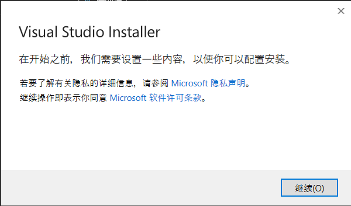
            </Step>
            <Step>
                滚到下方，选中 `使用 C++ 的桌面开发`，然后根据需求更改安装位置，点击右下角安装开始安装。

                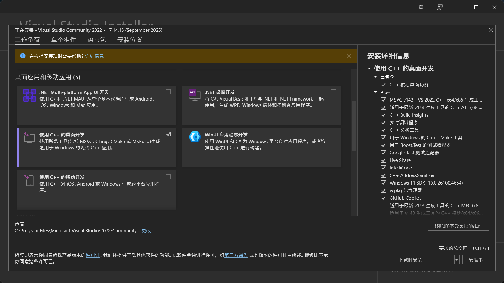
                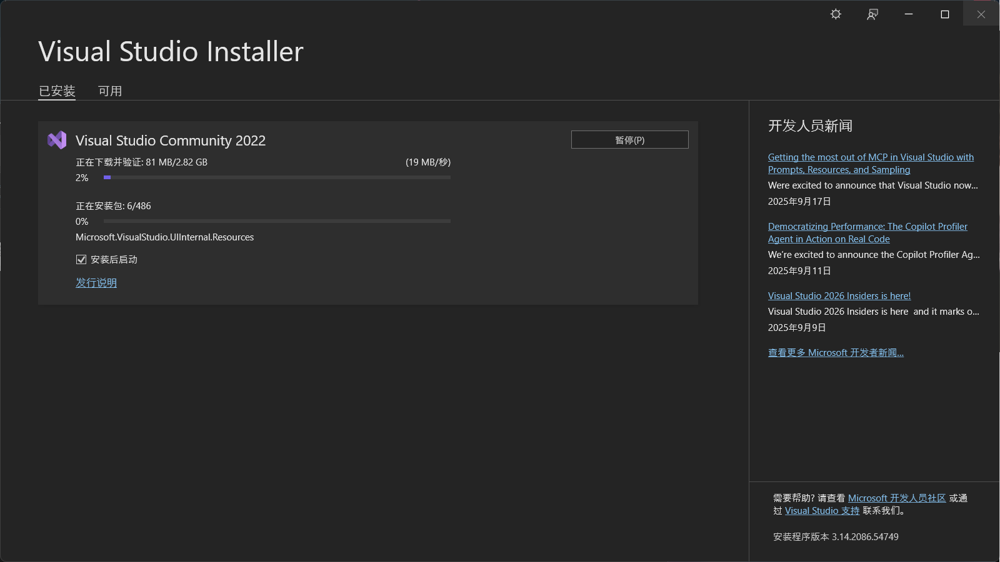
            </Step>
            <Step>
                等待安装完成。看到下图所示界面即为安装成功。

                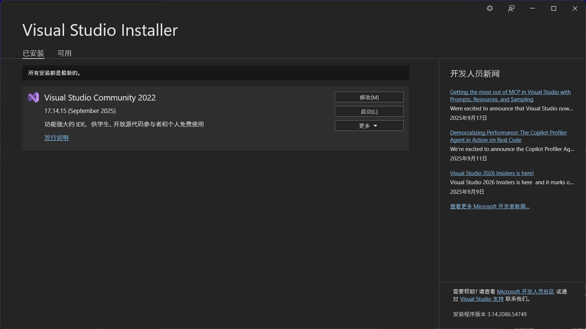
            </Step>
            <Step>
                打开 Visual Studio，使用 Microsoft 帐户或 Github 帐户登录 Visual Studio。

                

                <Callout>
                    **提示**

                    事实上不登陆也可以使用，但是建议登录。
                </Callout>
            </Step>
            <Step>
                选择你喜欢的主题，完成。

                
            </Step>
        </Steps>

        #### 使用 Visual Studio 编写 Hello World

        <Steps>
            <Step>
                启动 Visual Studio。

                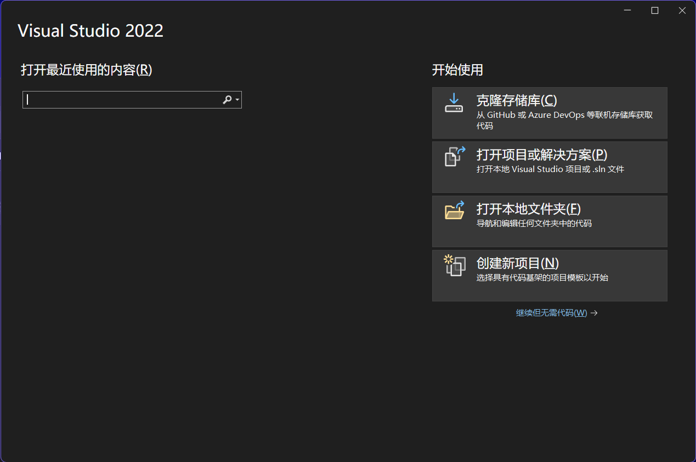
            </Step>
            <Step>
                点击 `创建新项目`，选择 `空项目`。

                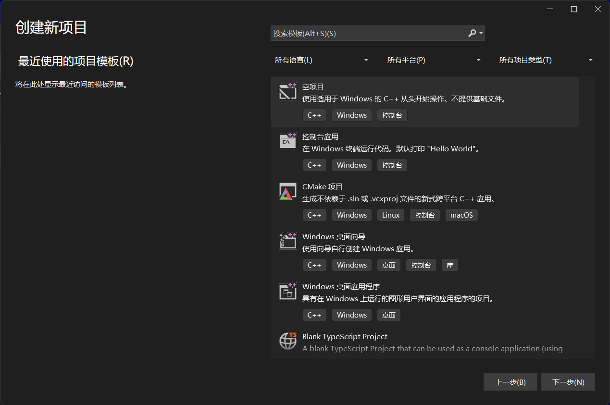
            </Step>
            <Step>
                输入项目名称，选择保存位置，点击 `创建`。

                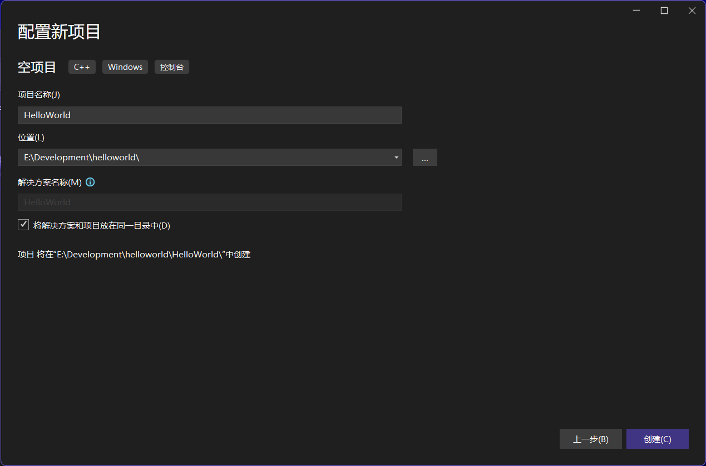
            </Step>
            <Step>
                在左侧解决方案界面中，右击你的项目名称，点击 `添加` > `新建项`。

                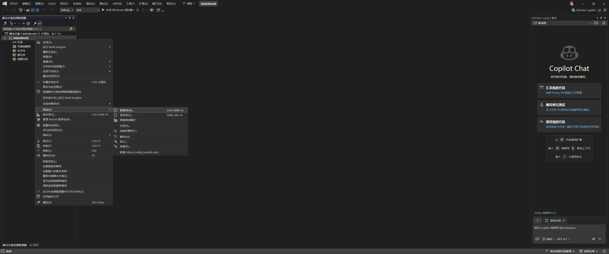
            </Step>
            <Step>
                在弹出的对话框中，输入文件名 `main.cpp`，点击 `添加`。

                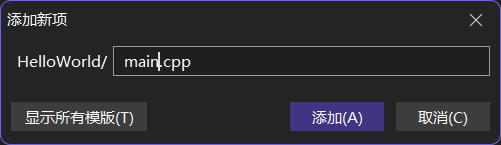
            </Step>
            <Step>
                在新建的文件中编写下列代码。

                ```cpp
                #include <iostream>

                // Hello, World!!
                int main() {
                    std::cout << "Hello, World!" << std::endl;
                    return 0;
                }
                ```

                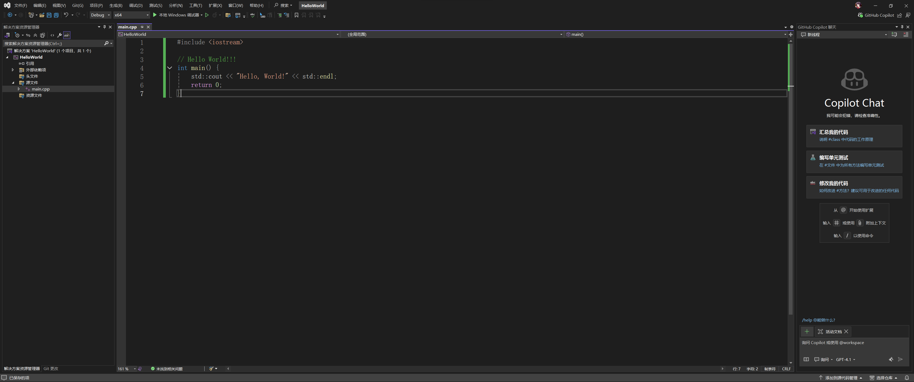
            </Step>
            <Step>
                在上方找到 `开始执行(不调试)` 按钮，或按键盘上的 `Ctrl + F5` 运行程序。

                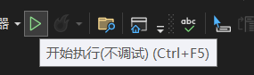
            </Step>
            <Step>
                Hello, World!

                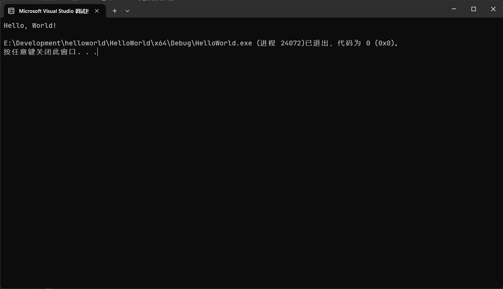
            </Step>
        </Steps>
    </Tab>
    <Tab id="clion">
        ## 安装 Clion

        ### 获取 JetBrains 学生包

        Clion 是 JetBrains 旗下的一款跨平台 C/C++ IDE，功能强大且易于使用。Clion 本身需要付费使用，但是对于学生，JetBrains 提供了免费的学生包，包含 Clion 在内的多款开发工具。作为东南大学成贤学院的学生，我们可以通过学校的教育邮箱来注册。

        <Steps>
            <Step>
                ### 启用学校邮箱

                登陆学校邮箱官网 [http://mail.cxxy.seu.edu.cn](http://mail.cxxy.seu.edu.cn)，点击下方 `一卡通帐户邮箱启用入口`。

                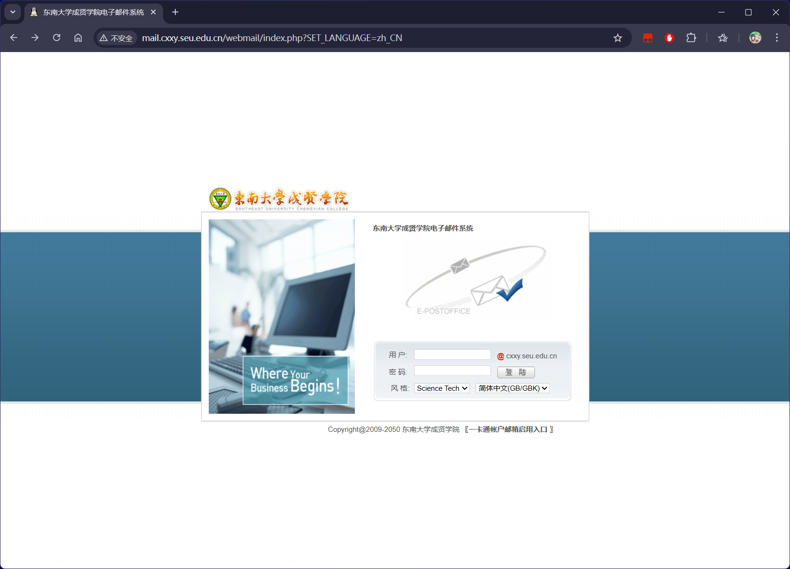

                输入一卡通号、初始密码（身份证后 6 位）和校验码，点击立即提交。

                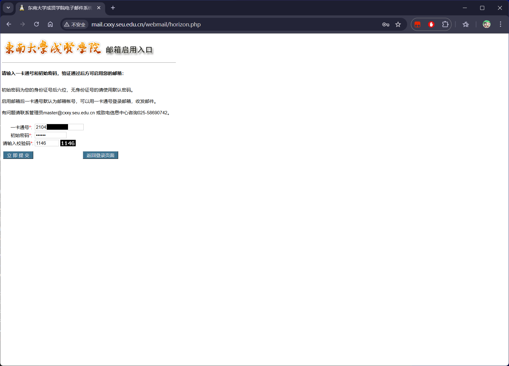

                输入邮箱别名（如 caixukun@cxxy.seu.edu.cn，个人建议可以使用自己姓名的拼音）和邮箱密码（使用默认密码即可），输入校验码（PS: 所属部门无需修改），点击立即提交。

                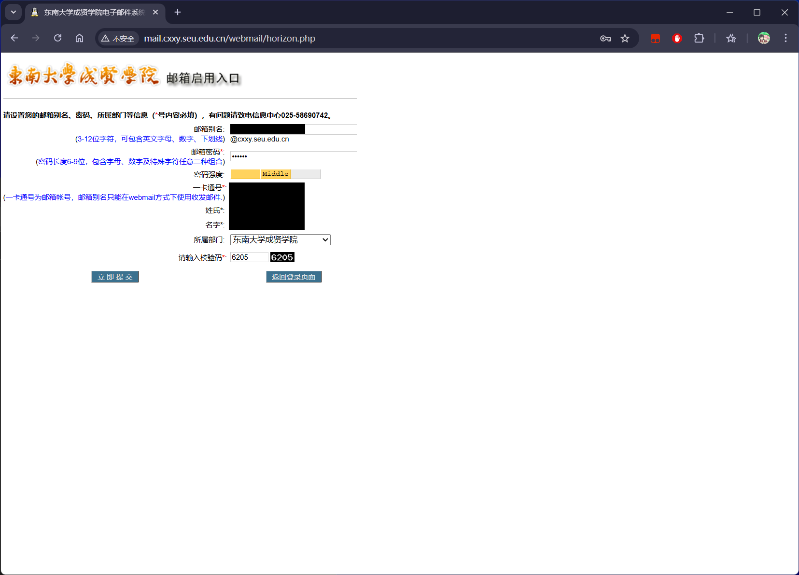
            </Step>
            <Step>
                ### 申请 JetBrains 学生包

                登陆 JetBrains 官网 [https://jetbrains.com](https://jetbrains.com)，在右上角选择 `Education` > `For students`，点击 `Request now`。

                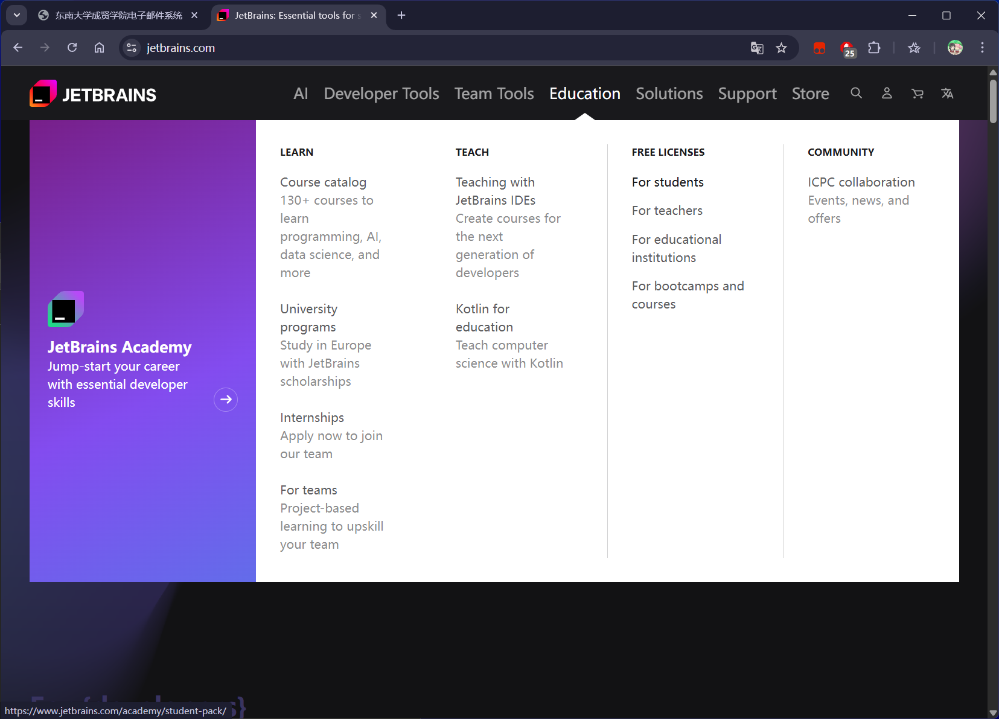

                在电子邮箱地址中填入刚刚注册的学校邮箱（`一卡通号@cxxy.seu.edu.cn` 或 `别名@cxxy.seu.edu.cn` 都行），然后在个人电子邮箱地址中输入你的个人邮箱地址（**如果以前没有用过邮箱，可以使用自己的 QQ 邮箱，即 `QQ号@qq.com`**），点击验证获取验证码。输入个人邮箱中收到的验证码，再次点击验证即可。

                
                

                勾选 `我已阅读并接受 JetBrains Account 协议`（**只需要勾选此项，勾选下面一项可能会使你收到垃圾邮件**），点击申请免费产品。JetBrains 会向你的学校邮箱中发送验证邮件，回到学校邮箱平台，等待邮件。

                <Callout type="info">
                    **注意**

                    学校邮箱系统收件速度有些慢，可能需要 5 - 10 分钟甚至更长。请不要着急，可以在 5 - 10 分钟以后刷新邮箱平台查看是否收到新邮件。
                </Callout>

                

                收到的邮件如下图所示

                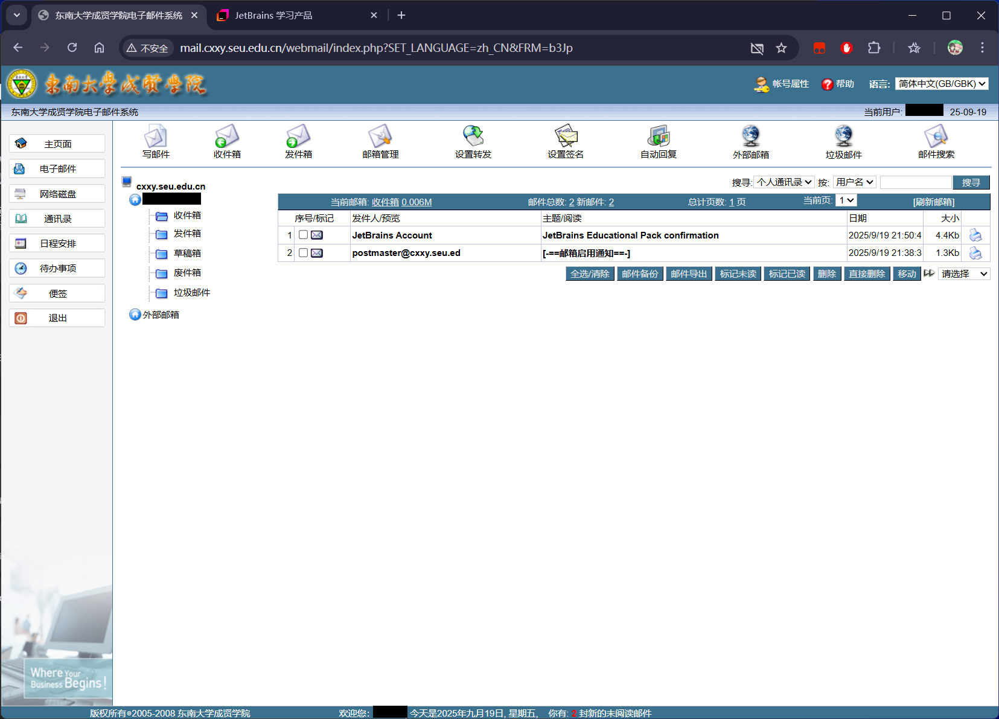
                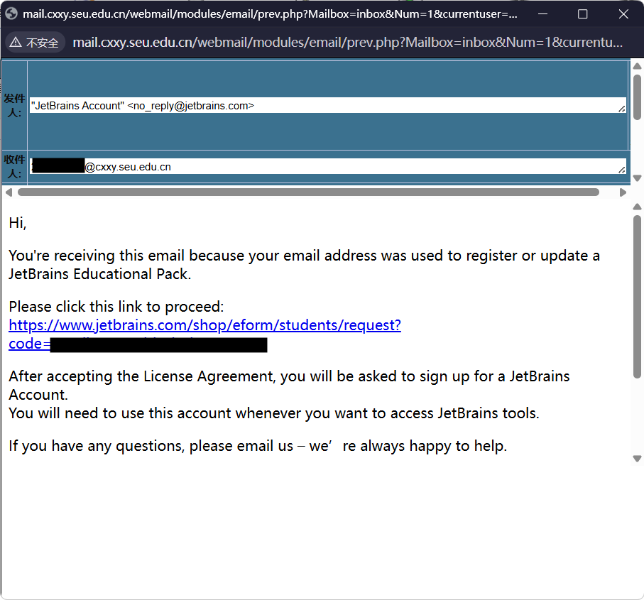

                **右击**图中蓝色的连接，点击复制链接，在浏览器中新建标签页，粘贴链接并进入。

                <Callout type="warn">
                    **注意**

                    不要左键点击链接直接打开，因为安全问题会被浏览器禁止。
                </Callout>

                点击 `Get started to use`，滑动到底部，点击 `I Accept`

                
                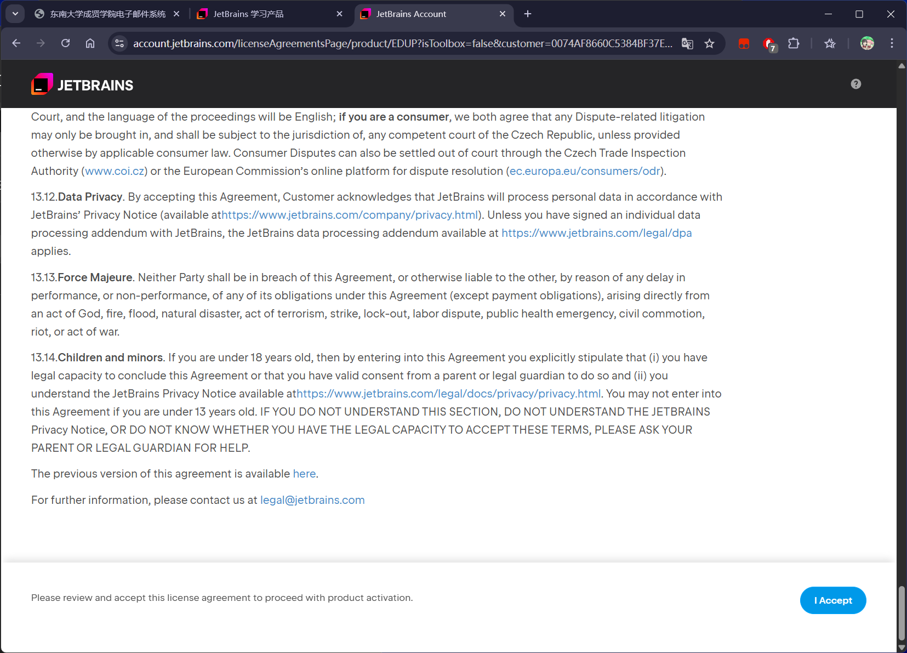

                注册 JetBrains 账号（邮箱可以使用个人邮箱），看到下面页面即代表完成

                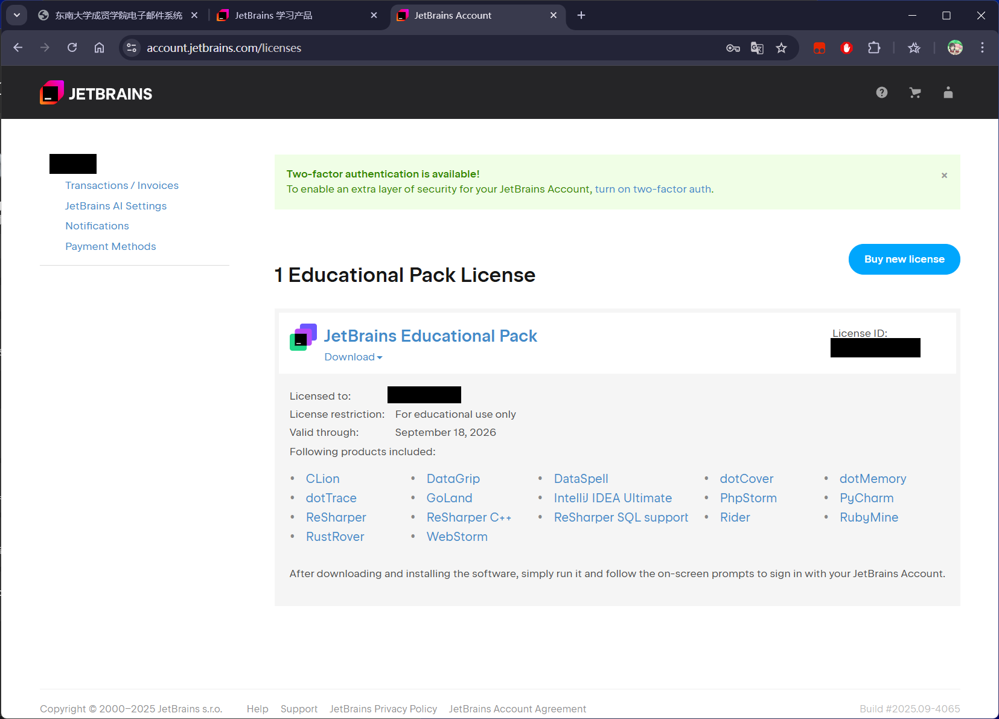
            </Step>
            <Step>
                ### 下载 Clion

                <Callout type="warn">
                    **注意**

                    本步骤内容的安装都是在系统盘（大部分为 C 盘）下进行的，请预留好 C 盘的空间。如若想要安装在其他地方，请自行查阅方法。~~(其实是懒得写了，晚点有时间可以补上)~~
                </Callout>

                打开 JetBrains Toolbox 官网 [https://www.jetbrains.com/toolbox-app](https://www.jetbrains.com/toolbox-app)，点击 `Download`。

                

                打开下载的安装包，点击 `安装` > `接受`

                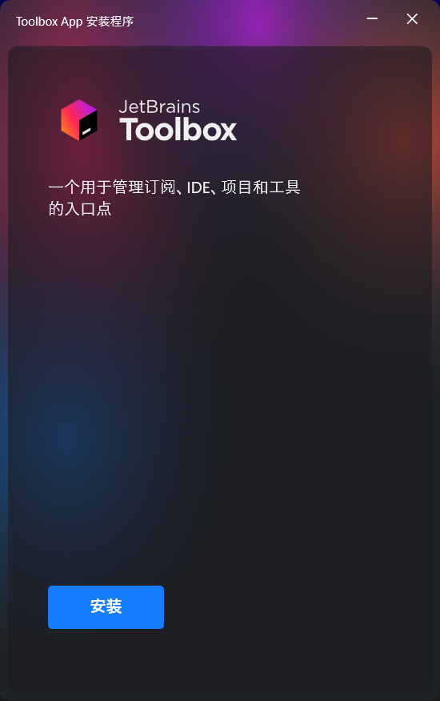
                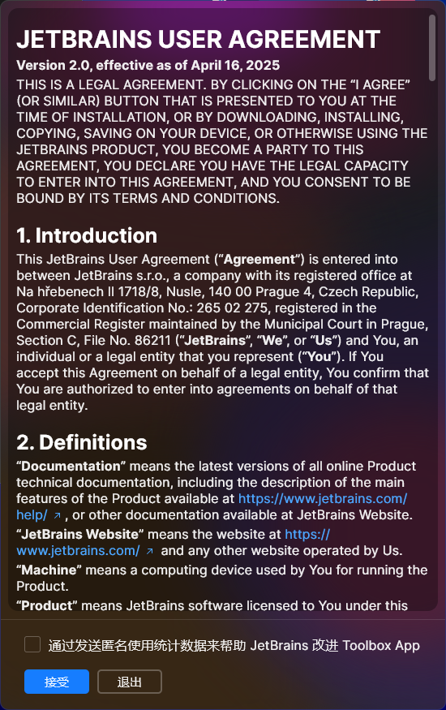

                安装完后会自动打开 ToolBox，点击右上角的设置图标，点击登陆

                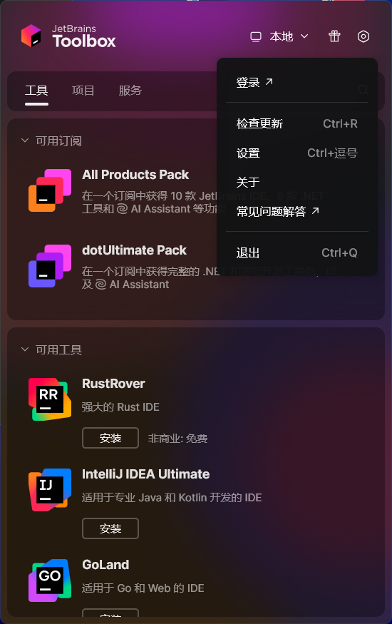

                在浏览器登陆，然后在弹出的弹窗中点击 `打开 JetBrains Toolbox`

                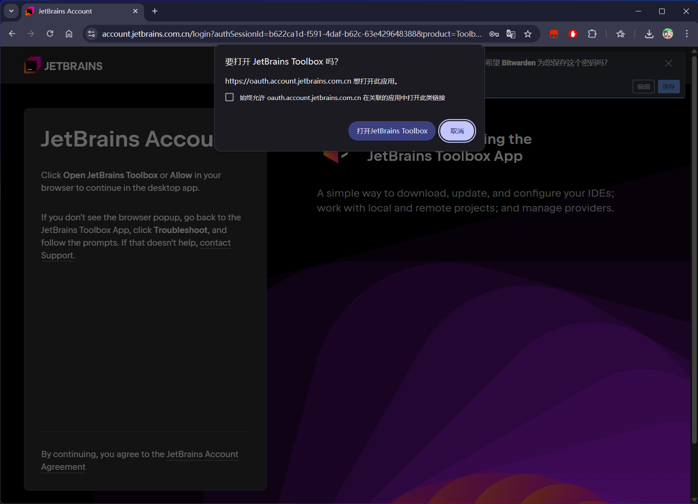
                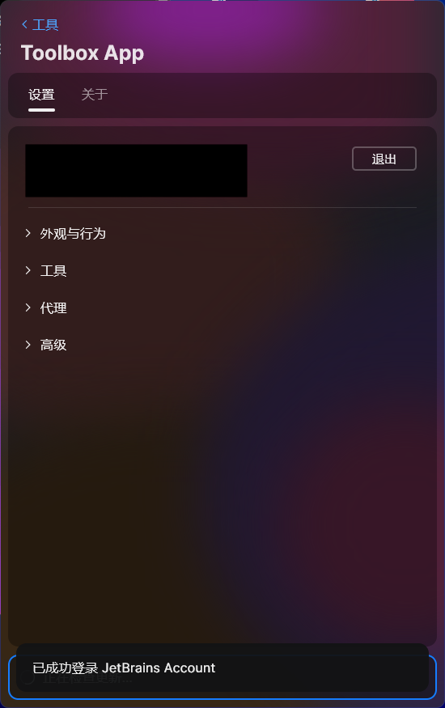

                点击左上角 `< 工具` 返回首页，列表下翻，找到 Clion，点击安装。

                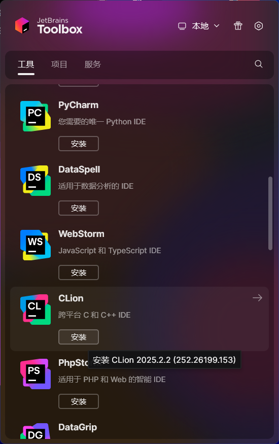

                耐心等待安装完毕。

                <Callout>
                    **提示**

                    如果你不小心关掉了 Toolbox，不用担心，在 Windows 托盘菜单中找到 Toolbox 的图标左键单击即可重新打开

                    
                </Callout>
            </Step>
        </Steps>

        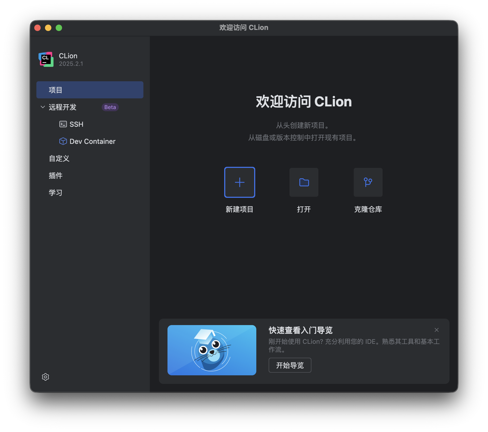

        恭喜你已经完成了 Clion 的安装。Clion 默认会带有 MinGW 编译工具链，所以完全可以开箱即用。不过如果需要更新更高级的编译链，请继续查看下一节。
    </Tab>
</Tabs>
